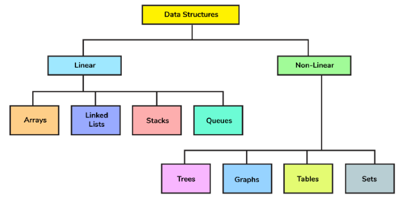

### Does array list holds data of different type?  
In Python list can hold elements of different type. 

```python
a_list = list()
a_list.append(1)
a_list.append("Sam")
a_list.append(1.0232)

print(a_list)
print(type(a_list[0]))
print((type(a_list[1])))
print(type(a_list[2]))
```

### What is finally block in Python?


In Python, the finally block is used in exception handling along with try and except blocks. The code inside the finally block is always executed whether an exception occurs or not. It is typically used to perform cleanup actions such as closing files or releasing resources, ensuring that these actions are taken regardless of whether an exception is raised.


### Python any() builtin function:

The any() function in Python is a built-in function that returns True if at least one element of an iterable (such as a list, tuple, set, dictionary, or string) evaluates to True. If the iterable is empty, it returns False.

### Python all() builtin function:
While any() returns True if at least one element in the iterable is True, all() returns True only if all elements in the iterable are True. If the iterable is empty, all() also returns True.

### What is @property decorator in python?

In Python, the @property decorator is a built-in decorator that allows you to define methods that can be accessed like attributes. It allows you to define a method that can be called without parentheses, making it look like a simple attribute access. The @property decorator is commonly used to implement getter methods in object-oriented programming.
Best explanation: https://www.programiz.com/python-programming/property

### Why do we need getters and setters in python?
