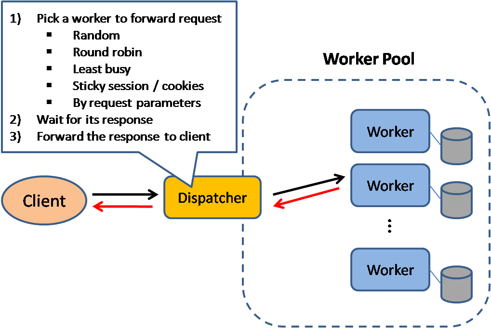

Load balancers distribute incoming client requests to computing resources such as application servers and databases. In each case, the load balancer returns the response from the computing resource to the appropriate client. Load balancers are effective at:

Preventing requests from going to unhealthy servers
Preventing overloading resources
Helping to eliminate a single point of failure
Load balancers can be implemented with hardware (expensive) or with software such as HAProxy.

Additional benefits include:

**SSL termination** - Decrypt incoming requests and encrypt server responses so backend servers do not have to perform these potentially expensive operations
Removes the need to install X.509 certificates on each server.

**Session persistence** - Issue cookies and route a specific client's requests to same instance if the web apps do not keep track of sessions
To protect against failures, it's common to set up multiple load balancers, either in active-passive or active-active mode.

## Load Balancer Architecture

Load balancers can route traffic based on various metrics, including:
- Random
- Least loaded
- Session/cookies
- Round robin or weighted round robin
- Layer 4
- Layer 7

